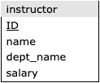
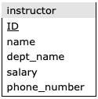
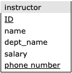
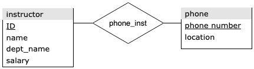

# PSO 02

### Instructor: Giselle Zeno

- PSO OL2/OL3 materials: [github](https://github.com/zeno129/PSO-CS448-S2021)

### Schema for instructor relation

Recall the schema that we used previously:



#### SQL data definition

```sql
create table instructor
    (ID             varchar(5), 
     name           varchar(20) not null, 
     dept_name      varchar(20), 
     salary         numeric(8,2) check (salary > 29000),
     primary key (ID),
     foreign key (dept_name) references department (dept_name)
        on delete set null
    );
```

#### Example data

|    ID | name       | dept_name   |   salary |
|------:|:-----------|:------------|---------:|
| 10101 | Srinivasan | Comp. Sci.  |    65000 |
| 12121 | Wu         | Finance     |    90000 |
| 15151 | Mozart     | Music       |    40000 |
| 22222 | Einstein   | Physics     |    95000 |
| 32343 | El Said    | History     |    60000 |
| 33456 | Gold       | Physics     |    87000 |
| 45565 | Katz       | Comp. Sci.  |    75000 |
| 58583 | Califieri  | History     |    62000 |
| 76543 | Singh      | Finance     |    80000 |
| 76766 | Crick      | Biology     |    72000 |
| 83821 | Brandt     | Comp. Sci.  |    92000 |
| 98345 | Kim        | Elec. Eng.  |    80000 |


## Schema Evolution

- Database design is usually not a one-time activity. 
- The needs of an organization evolve continually, and the data that it needs to store also evolve correspondingly.
- Changes in the schema can affect all aspects of the database application.

## Schema for instructor relation

Lets say that we want to add a phone number for instructors.

### Option 1

We could simply add an attribute *phone_number* to the _instructor_ relation.




#### ALTER TABLE Command

In SQLite, we add a new column `phone_number` to the `instructor` table as follows:

```sql
ALTER TABLE instructor ADD COLUMN phone_number varchar(12);
```

#### Update Records

Then, we can add phone numbers for each instructor using `UPDATE`

```sql
UPDATE instructor SET phone_number = '999-113-1268' WHERE ID = 10101;
UPDATE instructor SET phone_number = '761-856-0718' WHERE ID = 12121;
UPDATE instructor SET phone_number = '274-715-6841' WHERE ID = 15151;
UPDATE instructor SET phone_number = '727-780-1695' WHERE ID = 22222;
UPDATE instructor SET phone_number = '118-354-8109' WHERE ID = 32343;
UPDATE instructor SET phone_number = '589-847-6616' WHERE ID = 33456;
UPDATE instructor SET phone_number = '740-333-3446' WHERE ID = 45565;
UPDATE instructor SET phone_number = '749-361-2350' WHERE ID = 58583;
UPDATE instructor SET phone_number = '856-262-2788' WHERE ID = 76543;
UPDATE instructor SET phone_number = '418-409-7638' WHERE ID = 76766;
UPDATE instructor SET phone_number = '973-587-6940' WHERE ID = 83821;
UPDATE instructor SET phone_number = '548-012-7539' WHERE ID = 98345;
```

#### Updated Table

Here's the `instructor` table with `phone_number` column and values we inserted:

|    ID | name       | dept_name   |   salary | phone_number   |
|------:|:-----------|:------------|---------:|:---------------|
| 10101 | Srinivasan | Comp. Sci.  |    65000 | 999-113-1268   |
| 12121 | Wu         | Finance     |    90000 | 761-856-0718   |
| 15151 | Mozart     | Music       |    40000 | 274-715-6841   |
| 22222 | Einstein   | Physics     |    95000 | 727-780-1695   |
| 32343 | El Said    | History     |    60000 | 118-354-8109   |
| 33456 | Gold       | Physics     |    87000 | 589-847-6616   |
| 45565 | Katz       | Comp. Sci.  |    75000 | 740-333-3446   |
| 58583 | Califieri  | History     |    62000 | 749-361-2350   |
| 76543 | Singh      | Finance     |    80000 | 856-262-2788   |
| 76766 | Crick      | Biology     |    72000 | 418-409-7638   |
| 83821 | Brandt     | Comp. Sci.  |    92000 | 973-587-6940   |
| 98345 | Kim        | Elec. Eng.  |    80000 | 548-012-7539   |

## Schema for instructor relation

What if we want to have multiple phone number for instructors?

### Option 2

If we make the attribute _phone\_number_ part of the primary key, then we could have multiple phone numbers per instructor.



#### Example data

|    ID | name       | dept_name   |   salary | phone_number   |
|------:|:-----------|:------------|---------:|:---------------|
| 10101 | Srinivasan | Comp. Sci.  |    65000 | 999-113-1268   |
| 10101 | Srinivasan | Comp. Sci.  |    65000 | 906-214-7631   |

What's wrong with this approach?

It creates redundancy in the database (breaking Boyce-Codd Normal Form).

## Schema for instructor relation

What if we want to have multiple phone number for instructors?

### Option 3

Use of phone as an entity allows extra information about phone numbers (plus multiple phone numbers).



##### SQLite ALTER TABLE

- SQLite supports a limited subset of `ALTER TABLE`. 
- The `ALTER TABLE` command in SQLite allows the user to rename a table or to add a new column to an existing table. 
- It is **not possible** to:
  - _rename_ or _remove_ a column, or 
  - _add_ or _remove_ constraints from a table.

Therefore, the following will **not work** on SQLite:

```sql
ALTER TABLE instructor DROP COLUMN phone_number;
```

To "undo" the changes from Option (a), we can do the following:

1. create new table without the `phone_number` column,
2. copy all records,
3. drop the old table,
4. rename the new table.

#### 1. Create new instructor table

```sql
CREATE TABLE instructor_new
    (ID             varchar(5), 
     name           varchar(20) NOT NULL, 
     dept_name      varchar(20), 
     salary         numeric(8,2) check (salary > 29000),
     primary key (ID),
     foreign key (dept_name) references department (dept_name)
        ON DELETE SET NULL
    );
```

#### 2. Copy all records

```sql
INSERT INTO instructor_new
SELECT instructor.ID, instructor.name, instructor.dept_name, instructor.salary
FROM instructor;
```

#### 3. Drop old table

```sql
DROP TABLE instructor;
```

#### 4. Rename new table

```sql
ALTER TABLE instructor_new RENAME TO instructor;
```

## Schema for instructor relation

What if we want to have multiple phone number for instructors?

### Option 3


#### SQL data definitions

Create a tables to store and assign the phone numbers:

```sql
CREATE TABLE phone
    (phone_number   varchar(12), 
     location       varchar(6)
             CHECK (location IN ('Office', 'Cell', 'Home', 'Other')),
     PRIMARY KEY (phone_number)
    );
    
CREATE TABLE phone_inst
    (ID             varchar(5),
     phone_number   varchar(12), 
     PRIMARY KEY (ID, phone_number),
     FOREIGN KEY (ID) REFERENCES instructor
            ON DELETE CASCADE,
     FOREIGN KEY (ID) REFERENCES instructor
            ON DELETE CASCADE
    );
```


#### INSERT Commands for Table: phone

These will add the phone numbers:

```sql
INSERT INTO phone VALUES ('999-113-1268', 'Office');
INSERT INTO phone VALUES ('761-856-0718', 'Office');
INSERT INTO phone VALUES ('274-715-6841', 'Office');
INSERT INTO phone VALUES ('727-780-1695', 'Office');
INSERT INTO phone VALUES ('118-354-8109', 'Office');
INSERT INTO phone VALUES ('589-847-6616', 'Office');
INSERT INTO phone VALUES ('740-333-3446', 'Office');
INSERT INTO phone VALUES ('749-361-2350', 'Office');
INSERT INTO phone VALUES ('856-262-2788', 'Office');
INSERT INTO phone VALUES ('418-409-7638', 'Office');
INSERT INTO phone VALUES ('973-587-6940', 'Office');
INSERT INTO phone VALUES ('548-012-7539', 'Office');
INSERT INTO phone VALUES ('906-214-7631', 'Cell');
INSERT INTO phone VALUES ('851-591-5780', 'Cell');
INSERT INTO phone VALUES ('233-467-9285', 'Cell');
INSERT INTO phone VALUES ('318-795-0911', 'Cell');
INSERT INTO phone VALUES ('526-242-8559', 'Cell');
INSERT INTO phone VALUES ('488-016-4674', 'Cell');
INSERT INTO phone VALUES ('403-866-7060', 'Cell');
INSERT INTO phone VALUES ('540-653-4106', 'Cell');
INSERT INTO phone VALUES ('202-866-8444', 'Cell');
INSERT INTO phone VALUES ('407-517-2335', 'Cell');
INSERT INTO phone VALUES ('559-565-8598', 'Cell');
INSERT INTO phone VALUES ('804-869-1214', 'Cell');
```

#### INSERT Commands for Table: phone_inst

These will assign phone numbers to the instructors:

```sql
INSERT INTO phone_inst VALUES ('10101', '999-113-1268');
INSERT INTO phone_inst VALUES ('12121', '761-856-0718');
INSERT INTO phone_inst VALUES ('15151', '274-715-6841');
INSERT INTO phone_inst VALUES ('22222', '727-780-1695');
INSERT INTO phone_inst VALUES ('32343', '118-354-8109');
INSERT INTO phone_inst VALUES ('33456', '589-847-6616');
INSERT INTO phone_inst VALUES ('45565', '740-333-3446');
INSERT INTO phone_inst VALUES ('58583', '749-361-2350');
INSERT INTO phone_inst VALUES ('76543', '856-262-2788');
INSERT INTO phone_inst VALUES ('76766', '418-409-7638');
INSERT INTO phone_inst VALUES ('83821', '973-587-6940');
INSERT INTO phone_inst VALUES ('98345', '548-012-7539');
INSERT INTO phone_inst VALUES ('10101', '906-214-7631');
INSERT INTO phone_inst VALUES ('12121', '851-591-5780');
INSERT INTO phone_inst VALUES ('15151', '233-467-9285');
INSERT INTO phone_inst VALUES ('22222', '318-795-0911');
INSERT INTO phone_inst VALUES ('32343', '526-242-8559');
INSERT INTO phone_inst VALUES ('33456', '488-016-4674');
INSERT INTO phone_inst VALUES ('45565', '403-866-7060');
INSERT INTO phone_inst VALUES ('58583', '540-653-4106');
INSERT INTO phone_inst VALUES ('76543', '202-866-8444');
INSERT INTO phone_inst VALUES ('76766', '407-517-2335');
INSERT INTO phone_inst VALUES ('83821', '559-565-8598');
INSERT INTO phone_inst VALUES ('98345', '804-869-1214');
```

### Updated records

Show the instructor IDs, names, and _Office_ phone numbers

#### Query

```sql
SELECT instructor.ID, instructor.name, phone.phone_number, phone.location 
FROM instructor
LEFT JOIN phone_inst ON instructor.ID = phone_inst.ID
LEFT JOIN phone ON phone_inst.phone_number = phone.phone_number
WHERE location = 'Office';
```

#### Result

|    ID | name       | phone_number   | location   |
|------:|:-----------|:---------------|:-----------|
| 10101 | Srinivasan | 999-113-1268   | Office     |
| 12121 | Wu         | 761-856-0718   | Office     |
| 15151 | Mozart     | 274-715-6841   | Office     |
| 22222 | Einstein   | 727-780-1695   | Office     |
| 32343 | El Said    | 118-354-8109   | Office     |
| 33456 | Gold       | 589-847-6616   | Office     |
| 45565 | Katz       | 740-333-3446   | Office     |
| 58583 | Califieri  | 749-361-2350   | Office     |
| 76543 | Singh      | 856-262-2788   | Office     |
| 76766 | Crick      | 418-409-7638   | Office     |
| 83821 | Brandt     | 973-587-6940   | Office     |
| 98345 | Kim        | 548-012-7539   | Office     |
